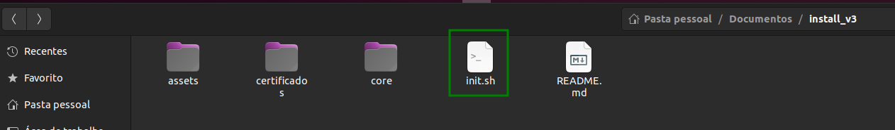
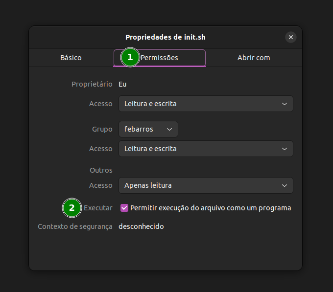
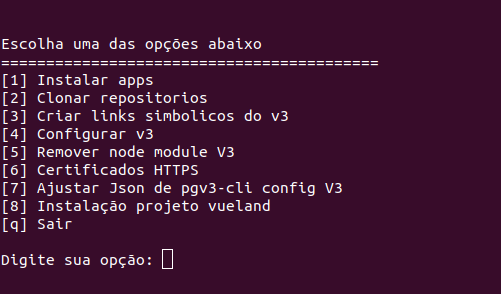

# V3 Config

Ao clonar o repositório acesse o mesmo e procure por **init.sh** de permissão de execução para o script.

Clique com o botão direito sobre ele e va em propriedades:

- 1 acessar aba

- 2 ativar check

após isso e só executar o script via terminal:

**img da tela inicial**

Neste script possuimos alguma opções entre elas:

## Importante

- Para instalação do v3 via script certifique-se que não tenha
  nenhum repositorio clonado dentro ~/uol_git

- Que todas node_modules relacionadas ao projeto-grafico-v3 e pastas do pgv3-cli sejam excluidas

- caso tenha registrado os caminhos do pgv3-cli config errado 
  vc tera que editar os json na opção [9]

- Você ira rodar o script com bash

## Na instalação dos app tesmos o seguintes app

## Clonar repositório v3

Será clonado somente o necessario para rodar o projeto-grafico.

## Checar o repositório v3

Verifica se os repositórios necessario para o funcionamento do v3 estao ok

OBS: Essa verifição só verifica se o diretorio esta presente em uol_git/ caso já esteja não sera feito o clone.

